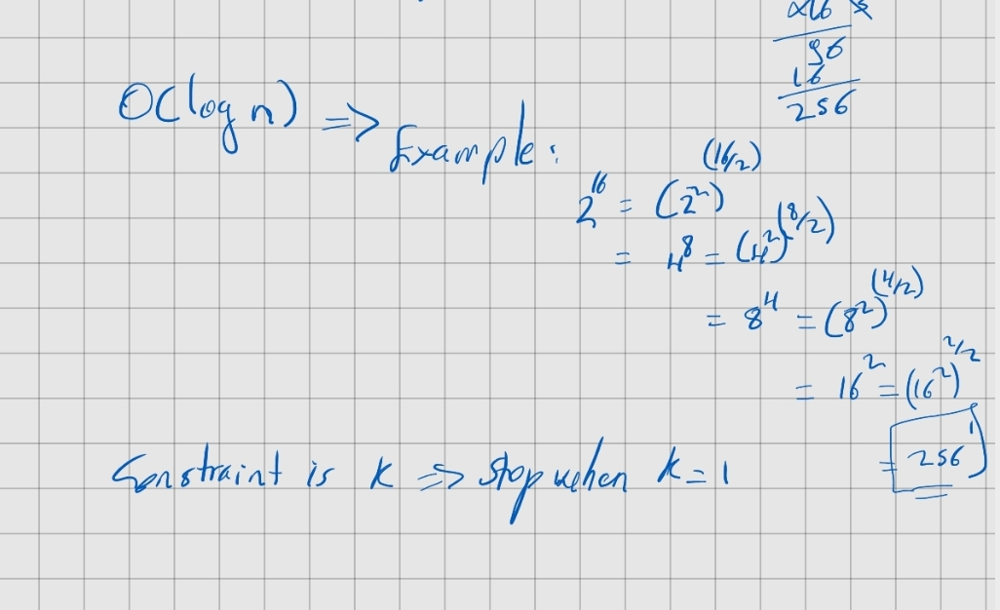

## 50. Pow(x,n)
### Given: x:int, n:int
### Task: Compute x^n

#### O(1) => (simple)
```python
return x**n
```

#### O(n) => (worth to try though time limit exceeds)

Example: 2^4 = 2.2.2.2

```python
res = 1
neg = n < 0
n = abs(n)

while n > 0:
    res = res * x
    n -= 1

if not neg:
    return res

return 1/res
``` 

##### O(Logn)

Example:



```python
res = 1.0
neg = n < 0
n = abs(n)

while n > 0:
    if n % 2 != 0:
        res *= x
    x *= x
    n //= 2

return res if not neg else 1/res

```


        